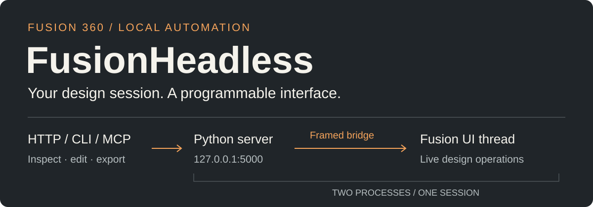

<p align="center">
  
</p>

**Control your running Fusion 360 session from scripts, the command line, or MCP.**
Inspect components, change parameters, render views, and export geometry through
one local service at `http://127.0.0.1:5000`.

[Use cases](#use-cases) · [Get started](#get-started) · [Command line](#command-line) · [HTTP API](#http-api) · [STL export](#print-oriented-stl-export) · [Development](#development)

Fusion must be running with the add-in loaded: all Fusion API work executes on
its UI thread. The HTTP server and its dependencies run in a separate Python process.

> **Local access only.** `/eval` and `/exec` execute Python inside Fusion.
> Keep the service on loopback; do not expose it through a public interface or proxy.

## From a command to a model

After setup, the shipped CLI can inspect the session, edit model parameters, and
save a rendered view. These examples use Windows Command Prompt; replace the
sample parameter names with names from your active design.

```
cli\fusion_cli.cmd status
cli\fusion_cli.cmd parameter --set d1=3.5 --set "d2=4 mm"
cli\fusion_cli.cmd render --view Home --output render.png
```

| Task | Interface |
| --- | --- |
| Inspect designs and cloud files | Components, bodies, projects, files, and parameters |
| Automate a design | Document operations, selection, parameter changes, and Python execution |
| Produce deliverables | Rendered views and geometry exports, including print-oriented STL |
| Connect MCP clients | List open documents, search components, and search Fusion API documentation |

## Use cases

<details>
<summary>Update your Fusion model from simulation software</summary>

Keep the parametric source model in Fusion while driving changes from a
simulation tool such as **Ansys Discovery**. A simulation-side script can set
dimensions, export updated STEP geometry, and feed it into the next analysis.
This is useful for iterating on wall thickness, clearances, or stiffener dimensions
without manually switching applications for every candidate.

Discovery provides a [Python script editor](https://ansyshelp.ansys.com/public/Views/Secured/corp/v251/en/discovery/UDA/user_manual/scripting/topics/c_scripteditor.html).
The following Windows example calls the installed FusionHeadless CLI from Python,
so the simulation tool does not need to load Fusion's Python libraries:

```
import os
import subprocess

repo = r"C:\path\to\FusionHeadless"  # Change to your checkout.
cli = [os.path.join(repo, "cli", ".venv", "Scripts", "python.exe"),
       os.path.join(repo, "cli", "fusion_cli.py")]
step_file = os.path.join(repo, "bracket.step")

subprocess.check_call(cli + ["parameter", "--set", "wall_thickness=3 mm"])
subprocess.check_call(cli + ["export", "--format", "step",
                             "--component", "Bracket", "--output", step_file])

# Next: import or refresh step_file using your simulation tool's own API.
```

Complete the server and CLI setup below first. Open the intended design in Fusion
and replace the sample parameter and component names. This updates the **active
Fusion design**; it does not automatically synchronize a Discovery model or run
a solver. Add the import/refresh and solve steps for your simulation environment,
and verify geometry selections and boundary conditions after an update. Run each
update → export → analysis sequence in order against the shared design session.

</details>

<details>
<summary>Batch-export STLs</summary>

Treat printable parts as build outputs. The supplied
[example Makefile](examples/Makefile.stls) exports `Bracket` and `Cover` components
to separate STL files with one command. Run from the repository root using GNU
Make and a POSIX shell, such as Git Bash on Windows:

```
make -f examples/Makefile.stls
make -f examples/Makefile.stls build/stl/Bracket.stl
```

Edit `PARTS` to match components in the active design. The example uses a `FORCE`
prerequisite because Make cannot detect changes in Fusion's live model, and
serializes exports even when invoked with `-j`. The CLI leaves identical output
files untouched, preserving timestamps for downstream slicing or packaging.

For components whose bodies have marked bed-contact faces, use
`ORIENT="Print Bed"` to enable [print-oriented export](#print-oriented-stl-export).
Export more complex assemblies with explicit body selections as described in
[the STL guide](docs/stl-export.md).

</details>

<details>
<summary>Product families and parameter sweeps</summary>

Set a size or configuration, then export and render each variant in sequence.

</details>

<details>
<summary>Repeatable release packages</summary>

Generate STEP, STL, and consistent preview images from the same design session.

</details>

<details>
<summary>Design checks in notebooks or scripts</summary>

Read body dimensions, volume, and material metadata; compare them with your own limits.

</details>

<details>
<summary>Assembly documentation</summary>

Show or isolate selected parts and render consistent views for manuals and build instructions.

</details>

<details>
<summary>CAD assistance from an MCP client</summary>

Discover open documents, find components, and look up Fusion API members before scripting an operation.

</details>

The strongest fit is a workflow that already lives in another tool but repeatedly
needs geometry or a small change from Fusion. A build runner still needs a running
Fusion session; this add-in does not provide a standalone CAD engine.

<a id="get-started"></a>

## 

### 1. Install the server dependencies

Run these commands from the repository root with Python installed.

**Windows**

```
py -3 -m venv .venv
.venv/Scripts/python.exe -m pip install -r requirements.txt
```

**macOS**

```
python3 -m venv .venv
.venv/bin/python -m pip install -r requirements.txt
```

### 2. Start the add-in in Fusion

Register this repository folder as a local add-in in Fusion's **Scripts and Add-Ins**
dialog, then run **FusionHeadless**. Its entry point is `FusionHeadless.py`.
The adapter launches the server using the repository's `.venv` interpreter.

If Fusion reports incomplete setup, finish the dependency installation above
and restart Fusion.

### 3. Check the connection

Open [the status endpoint](http://127.0.0.1:5000/status), or run this in PowerShell:

```
Invoke-RestMethod http://127.0.0.1:5000/status
```

A successful response has `status: "ok"` and a result containing
`status: "Server is running"`. The exact request schemas are available in
[OpenAPI](http://127.0.0.1:5000/openapi.json) while the add-in is running.

<a id="command-line"></a>

## 

Install the CLI's separate environment once:

```
py -3 -m venv cli\.venv
cli\.venv\Scripts\python.exe -m pip install -r cli\requirements.txt
```

On macOS or Linux, use `python3 -m venv cli/.venv` and
`cli/.venv/bin/python -m pip install -r cli/requirements.txt`, then run
`cli/fusion_cli.sh`. This is a client option; Fusion still runs on its host.

The CLI derives its verbs and switches from the server's OpenAPI schema.
Use `cli --refresh` after updating the add-in:

```
cli\fusion_cli.cmd cli --refresh
cli\fusion_cli.cmd render --view Home --hide "Body 1" --no-anti-aliased --output render.png
cli\fusion_cli.cmd exec --file operation.py
```

Use `--raw` for the unwrapped result, `--query` for JMESPath transformations,
and `--output` to write a file. Binary responses use the server's filename when
no output path is supplied; identical existing files are left untouched.
Set `FUSION_HEADLESS_URL` or `--base-url` to select the server origin.

<details>
<summary>Schema caching and Git Bash</summary>

The schema is cached by normalized server origin and the version in
`FusionHeadless.manifest`. It is fetched when absent, on `cli --refresh`, or
once after an unknown verb or switch. Git Bash can invoke the CLI Python script
directly with its Windows virtual-environment interpreter.

</details>

<a id="http-api"></a>

## 

`GET` reads resources. `POST` accepts a typed JSON object; FastAPI validates the
declared parameters. Consult [the API reference](docs/http-api.md) for payloads,
execution semantics, and restart behavior.

| Method | Routes |
| --- | --- |
| `GET` | `/status`, `/components`, `/bodies`, `/projects`, `/files` |
| `GET`, `POST` | `/parameter`, `/scripts` |
| `POST` | `/document`, `/select`, `/export`, `/render`, `/eval`, `/exec`, `/restart`, `/mcp` |

For example, read the active document's name with a function body sent to `/exec`:

```
POST /exec
Content-Type: application/json

{"code":"value = app.activeDocument\nreturn value.name"}
```

Use `return` to produce an `/exec` result. `/eval` evaluates an expression and
can serialize Fusion objects with a depth limit. Both run inside Fusion.
The typed API is **not wire-compatible** with the former free-form contract.

`POST /restart` reloads route and MCP extensions, then replaces the child server.
Requests receive `503` with `Retry-After: 1` until it is ready. Adapter and bridge
infrastructure changes require restarting the add-in; `/reload` no longer exists.

<a id="print-oriented-stl-export"></a>

## 

Mark the planar bed-contact face of each selected body with an appearance,
then pass that appearance name as `orient`:

```
cli\fusion_cli.cmd export --format stl --component Bracket --body Body1 --orient "Print Bed" --output bracket.stl
```

The exported mesh faces negative Z, is centered in X/Y, and rests at Z = 0.
The Fusion model is never rotated, and export restores temporary visibility changes.
Output is binary STL in millimeters, with unchanged scale.

Appearance matching is a case-sensitive substring. Each selected body needs a
marked planar face; a group must share a compatible contact plane. Omit `orient`
to keep the original orientation. There is no automatic packing.

See [the STL export guide](docs/stl-export.md) for assembly selection, validation,
geometry constraints, and the reusable `stl_orientation.orient_stl` function.

<a id="development"></a>

## 

The **FastAPI child** owns HTTP, validation, responses, and MCP. The **Fusion
adapter** supervises that child and sends Fusion work across a framed bridge to
the UI thread. Only the child binds port 5000.

| Change | Source of truth |
| --- | --- |
| Add a Fusion-backed HTTP route | One `@api_route` declaration in [fusion_routes.py](fusion_routes.py) |
| Add an MCP tool | One `@mcp_tool` declaration in [mcp_tools.py](mcp_tools.py) |
| Cross the process boundary | Explicit `@fusion` / `@server` registrations in [context.py](context.py) |

Route signatures drive both FastAPI registration and CLI schemas. Fusion-side
modules use built-in dependencies; third-party server dependencies live in `.venv`.

Read [architecture and development](docs/architecture.md) for adapter embedding,
context serialization, callback restrictions, recovery, and verification commands.
The process-level tests launch the real child against a fake Fusion host and
cover HTTP, bridge framing, mutations, binary responses, MCP, and lifecycle behavior.
